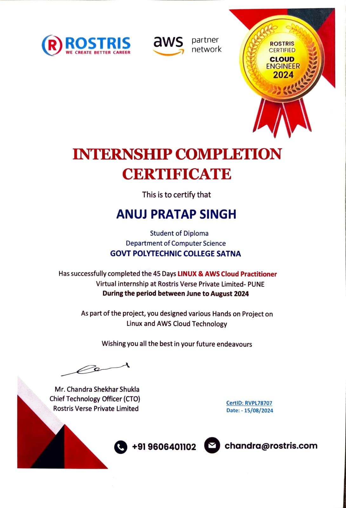
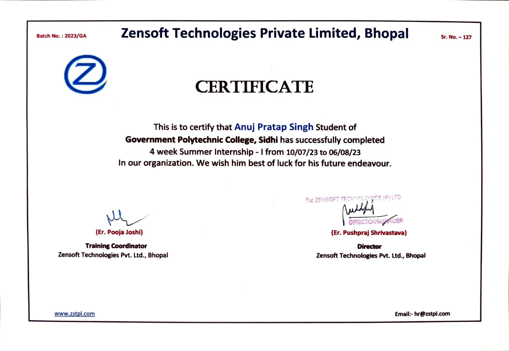

<h1 align="center">Hello Dosto 👋</h1>

  

  

---

# 👨‍💻 About Me

Hello! I'm *Anuj Pratap Singh, a passionate Computer Science Engineering student with a strong foundation built through my Diploma in Computer Science Engineering from **Government Polytechnic College Satna, where I graduated with **Grade A*.

🎓 Currently pursuing *B.Tech in Computer Science Engineering through Lateral Entry*.

🚀 Passionate about *DevOps, Linux Administration, Docker, Cloud Computing, Automation and System Fundamentals*.

💡 I believe in learning by doing. Through my *90 Days of DevOps Challenge*, I practice DevOps concepts daily, complete hands-on tasks, create notes, and share my learning journey consistently on GitHub.

📈 Continuously improving my skills in Linux, Containerization, Cloud Technologies, and modern DevOps practices.

🎯 My goal is to become a skilled *DevOps & Cloud Engineer* and build reliable, automated, and scalable infrastructure.

---

# 🔥 My DevOps Journey

### 🚀 90 Days of DevOps Challenge

A self-learning journey where I document my daily progress by practicing Linux, Git, Docker, Shell Scripting, Cloud concepts, and DevOps fundamentals.

Every day I:
- ✅ Complete practical tasks
- 📝 Write detailed notes
- 📂 Push my work to GitHub
- 📚 Learn new concepts consistently

---

# 🛠️ Tech Stack

### 🐧 DevOps & Cloud

### 🌐 Networking & System Fundamentals

- Computer Networking Basics
- Operating System Fundamentals
- Linux Command Line

### 💻 Programming & Databases

---

# 📜 Certifications

<table>
<tr>

<td align="center">
<h3>Linux & AWS Cloud Internship</h3>

 
ROSTRIS Verse Pvt. Ltd.
</td>

<td align="center">
<h3>Summer Internship</h3>

 
Zensoft Technologies, Bhopal
</td>

</tr>
</table>

---

# 🚀 Featured Projects

## 🐧 90DaysOfDevOps

A practical DevOps challenge repository containing daily tasks, notes, and hands-on learning progress.

---

## 🐳 devboard-frontend-docker

Dockerized frontend application demonstrating containerization and deployment concepts.

---

## 🐍 python-flask-app

A beginner Flask application project for understanding backend development and deployment basics.

---

# 📊 GitHub Analytics

---

# 🏆 GitHub Trophies

---

# 📈 Contribution Graph

---

# 🌐 Connect With Me

&nbsp;&nbsp;

---

<h3 align="center">

🚀 "Small daily improvements lead to big achievements."

</h3>
